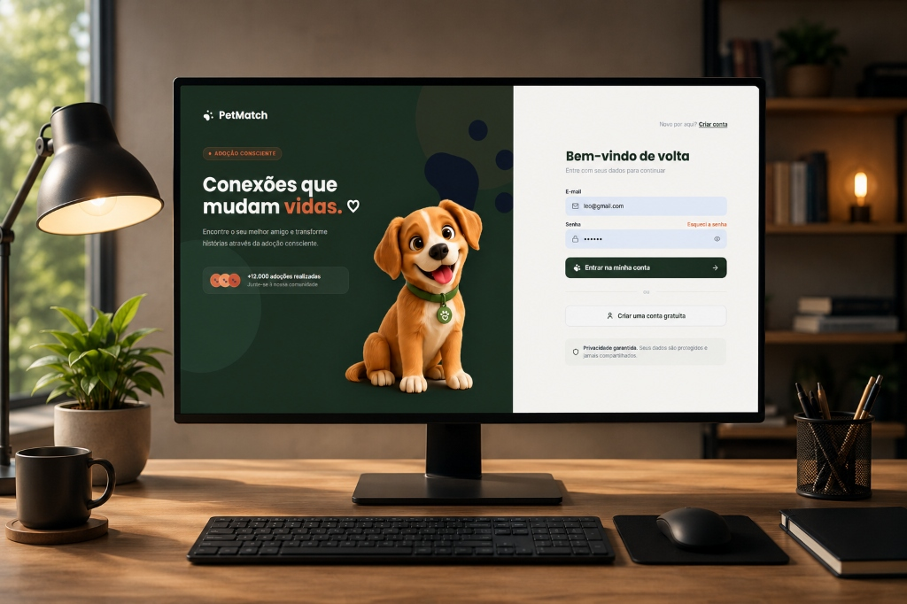

<p align="center">
  
</p>

<h1 align="center">PetMatch - Encontre seu Novo Melhor Amigo</h1>

<p align="center">
  <strong>Link do projeto online:</strong> <a href="https://camilyolivei.github.io/login" target="_blank">camilyolivei.github.io/login</a>
</p>


<p align="center">
  
</p>


O **PetMatch** é uma plataforma moderna e interativa desenvolvida em React + Vite para conectar protetores de animais (ONGs) a adotantes em potencial (tutores). Inspirado na mecânica de deslizamento de cartões (Tinder), o sistema facilita a adoção responsável de animais de estimação, o reporte de resgates de animais em situação de risco e o controle financeiro de doações.

---

## Como Executar o Projeto Passo a Passo

Siga as instruções abaixo para rodar o projeto localmente em sua máquina.

### Pré-requisitos
Certifique-se de ter o **Node.js** (versão 18 ou superior) instalado em sua máquina.

### 1. Clonar o Repositório
```bash
git clone https://github.com/camilyolivei/projetoReact-pet-Match.git
cd projetoReact-pet-Match
```

### 2. Instalar as Dependências
Instale as dependências do projeto listadas no `package.json` (incluindo Axios, Lucide React, React Router, etc.):
```bash
npm install
```

### 3. Executar o Servidor de Desenvolvimento
Inicie o ambiente de desenvolvimento local:
```bash
npm run dev
```
O console exibirá o endereço local, geralmente:
* http://localhost:5174/ ou http://localhost:5173/

### 4. Build de Produção
Para gerar a versão otimizada para publicação:
```bash
npm run build
```
Os arquivos gerados ficarão na pasta `dist/`.

### 5. Pré-visualizar o Build Localmente
```bash
npm run preview
```

### 6. Publicar no GitHub Pages
O projeto está configurado para deploy automático no GitHub Pages:
```bash
npm run deploy
```

---

## Credenciais de Teste
Para testar a conexão real com a API sem precisar criar um novo cadastro:
* **Usuário:** leo@gmail.com
* **Senha:** leo123

---

## Telas e Funcionalidades do Projeto

O sistema conta com dois tipos de perfis distintos (Tutor Comum e ONG), que adaptam as opções visíveis no menu lateral:

1. **Login & Cadastro**:
   - Formulários integrados ao hook de validação em tempo real (`useForm.js`).
   - O cadastro de ONGs exibe campos condicionais obrigatórios (CNPJ, Site, Descrição e Endereço Completo) validados via expressões regulares (Regex).
2. **Painel de Controle (Dashboard)**:
   - Apresenta estatísticas dinâmicas em tempo real (Total de pets disponíveis, total de solicitações de adoções, alertas de resgate pendentes e total arrecadado em doações).
   - Apresenta atalhos rápidos e listagem dos últimos resgates e adoções solicitadas.
3. **Encontre seu Match (Tinder Swipe)**:
   - Interface de descoberta de pets onde o usuário pode dar "Like" (curtir) ou "Dislike" (passar).
   - O algoritmo descarta pets cadastrados pela própria ONG do usuário ativo.
   - Em caso de curtida mútua, uma sobreposição de match premium é exibida e o usuário pode iniciar a adoção diretamente dali.
4. **Meus Pets (Exclusivo para ONGs)**:
   - Painel para cadastrar novos animais, listar pets ativos/adotados, editar dados do pet e remover cadastros.
5. **Adoções**:
   - **Minhas Solicitações**: Acompanhamento dos pedidos de adoção feitos pelo tutor logado.
   - **Solicitações Recebidas**: Painel de controle para ONGs aprovarem ou rejeitarem pedidos de adoção de seus pets.
6. **Central de Resgate**:
   - Formulário para registrar resgates fornecendo localização e descrição do incidente.
   - Listagem em tempo real de animais em situação de risco com suporte a edição e exclusão de alertas.
7. **Quero Doar**:
   - Central de doações para apoiar financeiramente ONGs cadastradas.
8. **Meu Perfil**:
   - Gerenciamento de avatar e informações pessoais.
   - Interface 100% responsiva para celulares com empilhamento de botões de ação e campos de endereço em colunas adaptáveis.

---

## Arquitetura do Projeto

A organização de pastas segue boas práticas do React para manter a escalabilidade do código:

```
src/
├── componentes/        # Componentes reutilizáveis (Layout, Botao, CampoFormulario, etc.)
├── context/            # Contexto global para gerenciamento de estado (AppContext.jsx)
├── estilos/            # Arquivos de estilização vanilla CSS (global.css e app.css)
├── hooks/              # Custom Hooks reutilizáveis (useForm.js)
├── paginas/            # Componentes de páginas completas (Login, Perfil, Descobrir, etc.)
├── rotas/              # Configurações de rotas com React Router DOM
└── servicos/           # Serviços de comunicação:
    ├── api.js          # Chamadas do Axios centralizadas com wrapper utilitário
    └── autenticacao.js # Controle de cookies, localStorage e fluxo de login/cadastro
```

### Tecnologias e Conceitos Utilizados:
* **React Hooks**: Controle robusto e encapsulado via `useForm` com validação de Regex nas perdas de foco (`onBlur`).
* **Axios & REST API**: Comunicação unificada e limpa com o backend hospedado na nuvem (Render), gerenciada por uma função centralizada `requisitar` que injeta o cabeçalho `Authorization: Bearer <token>` automaticamente por meio de interceptadores.
* **BroadcastChannel (Real-time)**: Sincronização em tempo real de estados de dados e sessão do usuário ativo entre diferentes abas abertas no mesmo navegador.
* **Estilos Premium**: CSS puro com foco em design moderno (efeito glassmorphism, microanimações, botões customizados e responsividade fluida para mobile).
